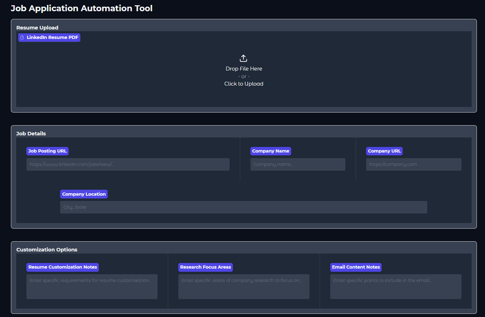

# JobApplicationFlow

Welcome to the JobApplicationFlow Crew project, powered by [crewAI](https://crewai.com) and [Gradio](https://gradio.app). 

This project is a flow of AI agents that will generate a job application report, a crew generated resume and a reviewed email for a job application based on the user LinkedIn profile resume, job posting and company information.

The information of the job application and the company will be autommatically by the crews that we use based on the informations we pass in the interface.



## Installation

Ensure you have Python >=3.10 <=3.13 installed on your system. 

Clone the repository:

```bash	
git clone https://github.com/rafacalassara/JobApplicationFlow.git
cd JobApplicationFlow
```

Create a conda environment:

```bash
conda create -n job_application_flow python=3.12
```

Next, activate the environment:

```bash
conda activate job_application_flow
```

Now install the dependencies:

```bash
pip install -r requirements.txt
```

Add the `OPENAI_API_KEY` and `SERPER_API_KEY` into the `.env` file.

## Running the Project

To kickstart the project run the following command to initialize the interface:

```bash
python app.py
```

This command initializes the Gradio interface and starts the web server on `http://127.0.0.1:7860`.

This example, unmodified, will create a company report, a crew generated resume and a reviewed email for the job application. The files will be saved in the outputs folder.
