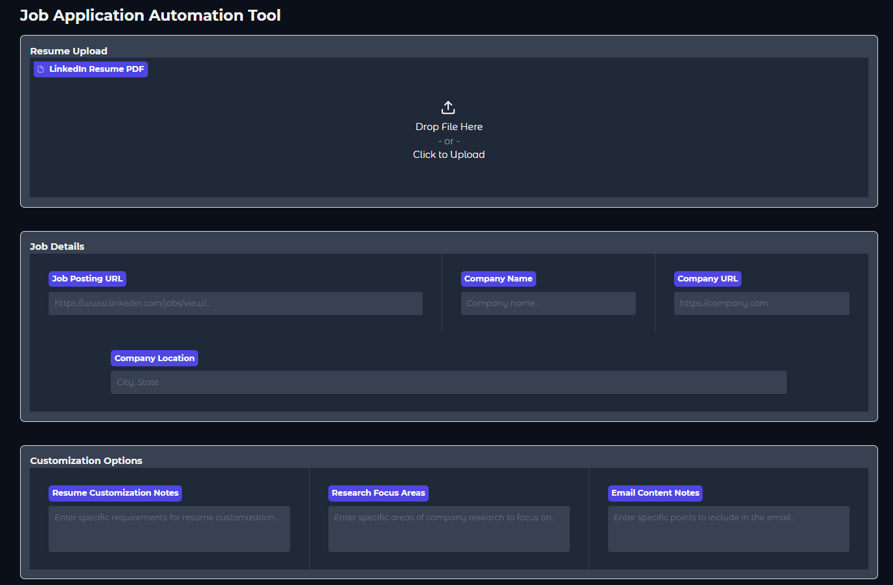

# JobApplicationFlow

Welcome to the JobApplicationFlow Crew project, powered by [crewAI](https://crewai.com) and [Gradio](https://gradio.app). 

This project is a flow of AI agents that will generate a job application report, a crew generated resume and a reviewed email for a job application based on the user LinkedIn profile resume, job posting and company information.

The information of the job application and the company will be automatically gathered by the crews that we use based on the information we pass in the interface.

**Now available as an MCP (Model Context Protocol) server!** Use this tool directly from any LLM that supports MCP, such as Claude Desktop, or through the Gradio web interface.



## Installation

Ensure you have [conda](https://docs.conda.io/projects/conda/en/latest/user-guide/install/) and Python >=3.10 <=3.13 installed on your system. 

Clone the repository:

```bash	
git clone https://github.com/rafacalassara/JobApplicationFlow.git
cd JobApplicationFlow
```

Create a conda environment:

```bash
conda create -n job_application_flow python=3.12
```

Next, activate the environment:

```bash
conda activate job_application_flow
```

Now install the dependencies:

```bash
pip install -r requirements.txt
```

Add the `OPENAI_API_KEY` and `SERPER_API_KEY` into the `.env` file.

## Running the Project

### Option 1: Using Docker (Recommended)

The easiest way to run the project is using Docker Compose, which will set up both the Gradio UI and the MCP server:

```bash
# Make sure you have .env file with your API keys
docker-compose up -d
```

This will start:
- **Gradio UI**: Available at `http://localhost:7860`
- **MCP Server**: Running in the background for MCP clients

To stop the services:

```bash
docker-compose down
```

### Option 2: Running Locally

To kickstart the project run the following command to initialize the interface:

```bash
python app.py
```

This command initializes the Gradio interface and starts the web server on `http://127.0.0.1:7860`.

This example, unmodified, will create a company report, a crew generated resume and a reviewed email for the job application. The files will be saved in the outputs folder.

### Option 3: Using as an MCP Server

You can use this project as an MCP tool from any LLM client that supports the Model Context Protocol (like Claude Desktop).

1. Build the MCP Docker image:

```bash
docker build -f Dockerfile.mcp -t job-application-flow-mcp .
```

2. Configure your MCP client (e.g., Claude Desktop) by adding this to your configuration file:

```json
{
  "mcpServers": {
    "job-application-flow": {
      "command": "docker",
      "args": [
        "run",
        "-i",
        "--rm",
        "--env-file",
        "/path/to/your/.env",
        "-v",
        "/path/to/outputs:/usr/src/app/outputs",
        "-v",
        "/path/to/inputs:/usr/src/app/inputs",
        "job-application-flow-mcp"
      ]
    }
  }
}
```

Replace `/path/to/your/.env` with the full path to your `.env` file containing your API keys.

The MCP server exposes a `process_job_application` tool that can be called by any LLM to generate job application materials.

## Environment Variables

The project uses the following environment variables (set them in your `.env` file):

### Required
- `OPENAI_API_KEY`: Your OpenAI API key for LLM operations
- `SERPER_API_KEY`: Your Serper API key for web search

### Optional
- `GRADIO_SERVER_NAME`: Server bind address (default: `0.0.0.0`)
- `GRADIO_SERVER_PORT`: Server port (default: `7860`)
- `OPENAI_MODEL_NAME`: OpenAI model to use (default: `gpt-4o-mini`)
- `OPENAI_API_BASE`: OpenAI API base URL (default: `https://api.openai.com/v1`)

Copy `.env.example` to `.env` and fill in your API keys:

```bash
cp .env.example .env
# Edit .env with your favorite editor
```

## How the Project Works

Based on the job application, the company and the user LinkedIn profile, the crews will work as follows:

1. The `Tailor Resume Crew` will convert the user PDF LinkedIn profile into a Markdown file crew generated resume, scrape the job application URL and adjust the user resume accordingly.

2. The `Company Report Crew` will search for the company information using the Serper API and create a detailed report on the company main points.

3. Then the `Email Writer Crew` will create an email based on the company report, the user resume and the job application information for the user to send.

## MCP Tool Usage

When using the MCP server, the LLM can call the `process_job_application` tool with the following parameters:

**Required:**
- `linkedin_source_resume_path`: Path to your resume PDF
- `job_posting`: Job posting URL
- `company`: Company name
- `company_url`: Company website
- `company_location`: Company location

**Optional:**
- `user_considerations_for_resume_crew`: Custom resume tailoring instructions
- `user_considerations_for_companies_research_crew`: Custom company research focus
- `user_considerations_for_email_crew`: Custom email generation instructions

The tool will return the paths and content of the generated files (resume, company report, and email).
